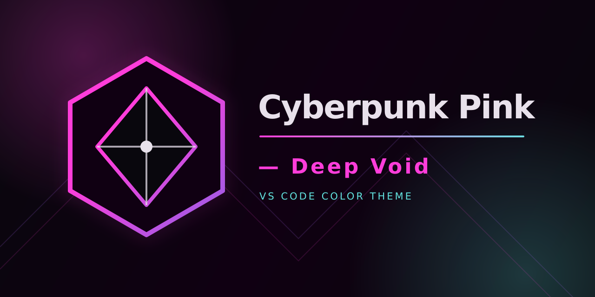

# Cyberpunk Pink — Deep Void

Tema de color para VS Code derivado de [SynthWave '84](https://github.com/robb0wen/synthwave-vscode)
de Robb Owen. El resaltado de sintaxis (strings, keywords, variables,
funciones, clases, tags) queda igual a SynthWave '84; lo que cambia es el
fondo del editor, la UI general, la selección y la terminal integrada, que
pasan a la paleta **Cyberpunk Pink — Deep Void** usada en el resto del setup
(GNOME, Guake, GNOME Terminal, Conky).

No incluye el efecto de "neon glow" del tema original (esa función parchea
archivos internos de VS Code). Ver `docs/plan.md` para el porqué y el detalle
completo de la paleta.

## Instalación (desarrollo local)

```bash
npm install -g @vscode/vsce
vsce package
code --install-extension cyberpunk-pink-deep-void-0.0.1.vsix
```

## Estado

Trabajo en curso. El theme base ya está generado (`themes/cyberpunk-pink-color-theme.json`);
falta: revisión visual, icono/banner propios, y completar los campos
`publisher`/`repository` en `package.json` antes de publicar.

## Créditos

Basado en SynthWave '84 (MIT License, Copyright (c) 2019 Robb Owen). Ver `LICENSE`.
